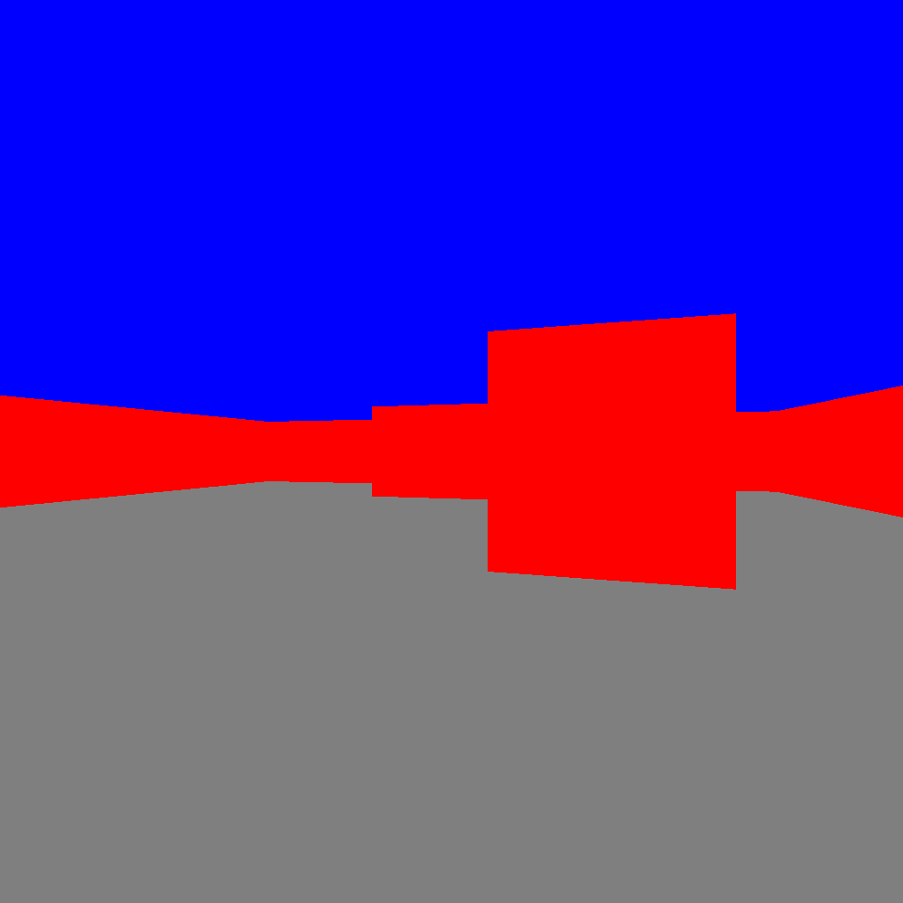

# wolf
Epitech project by troncy_l

This is the base part of the wolf3d, There is only one bonus : Multiplayer in TCP/IP protocol (compatible with bache_a).

The entire project was coded in less that 48 hours ! this why I do not have any texture or map interaction.

